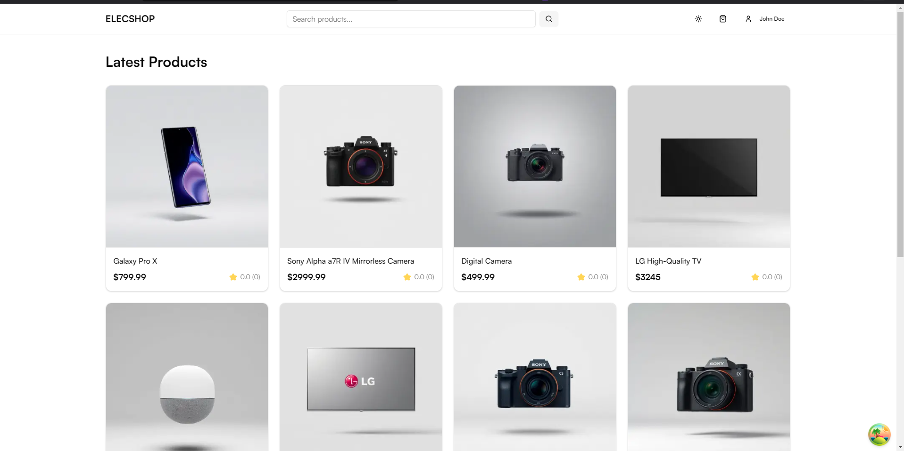

# Elecshop - Modern eCommerce Platform

A full-stack eCommerce platform built with Next.js, Nest.js, and MongoDB, featuring AI-powered product management and modern authentication.



## Features 🚀

### Core Features
- Full-featured shopping cart with:
  - server-side persistence for logged in users
  - local storage for guests
- Product reviews and ratings system
- Advanced product search with pagination
- User account management & order history
- Secure authentication with JWT (access & refresh tokens)
- Role-based access control (Admin/User)

### AI-Powered Features
- AI Product Creator for generating product listings (Vercel AI SDK)
- Image generation for product images (using Replicate)
- Product Development Expert chat interface
- Smart product recommendations

### Technical Highlights
- Modern monorepo structure with apps for web and server
- Type-safe API communication with shared types
- Real-time updates using modern state management
- Cloudinary integration for image management
- Secure payment processing with PayPal and Stripe
- Modern UI with Shadcn components and Tailwind CSS

## Tech Stack 💻

### Frontend
- Next.js 15 with App Router
- TypeScript
- Tailwind CSS
- Shadcn UI Components
- Framer Motion for animations
- Chat interface with Vercel AI SDK

### Backend
- Nest.js with TypeScript
- MongoDB with Mongoose
- JWT Authentication
- Swagger API Documentation
- Argon2 for password hashing
- Cloudinary for media storage
- OpenAI integration
- Text Vercel AI SDK
- Replicate for image generation

### DevOps & Tools
- Monorepo architecture
- pnpm for package management
- Docker support
- Railway for backend deployment
- Vercel for frontend deployment

## Getting Started 🏃

### Prerequisites
- Node.js (v16 or higher)
- pnpm (preferred package manager)
- MongoDB instance (Docker preferred)
- OpenAI and Replicate API keys (for AI features)
- Cloudinary account (for image storage)

### Setting Up the Project

1. Clone the project

```bash
git clone https://github.com/cuddles47/ecommerce
```

2. Navigate to project directory

```bash
cd ecommerce
```

3. Remove remote origin (optional)

```bash
git remote remove origin
```

4. Install dependencies (root)

```bash
pnpm install
```

### Environment Variables Setup

#### Frontend (.env.local in apps/frontend)

```
NEXT_PUBLIC_API_URL=http://localhost:4000/api/v1
OPENAI_API_KEY=your_openai_key
NEXT_PUBLIC_PAYPAL_CLIENT_ID=your_paypal_client_id
STRIPE_SECRET_KEY=your_stripe_secret_key
NEXT_PUBLIC_STRIPE_PUBLISHABLE_KEY=your_stripe_publishable_key
```

#### Backend (.env in apps/backend)

```
PORT=4000
ALLOWED_ORIGINS=http://localhost:3000
JWT_SECRET=your_jwt_secret
JWT_ACCESS_SECRET=your_jwt_access_secret
JWT_REFRESH_SECRET=your_jwt_refresh_secret
MONGODB_URI=mongodb://localhost:27017/modern-ecommerce
CLOUDINARY_CLOUD_NAME=your_cloudinary_cloud_name
CLOUDINARY_API_KEY=your_cloudinary_api_key
CLOUDINARY_API_SECRET=your_cloudinary_api_secret
REPLICATE_API_TOKEN=your_replicate_api_token
OPENAI_API_KEY=your_openai_api_key
```

## Running the Application 🚀

### Start MongoDB with Docker
```bash
cd apps/backend
pnpm start:mongo
```

### Seed the Database
```bash
cd apps/backend
pnpm seed -- seed:products
pnpm seed -- seed:users
```
This creates an admin account with email: `admin@example.com` and password: `admin123`, plus sample products and users.

### Start Backend Server
```bash
# From root directory
pnpm dev:server
# OR from backend directory
cd apps/backend
pnpm dev
```

### Start Frontend
```bash
# From root directory
pnpm dev:web
# OR from frontend directory
cd apps/frontend
pnpm dev
```

### Access the Application
- Frontend: [http://localhost:3000](http://localhost:3000)
- Backend API: [http://localhost:4000/api/v1](http://localhost:4000/api/v1)
- API Documentation: [http://localhost:4000/api](http://localhost:4000/api)


**Thanks for sharing** 🚀

